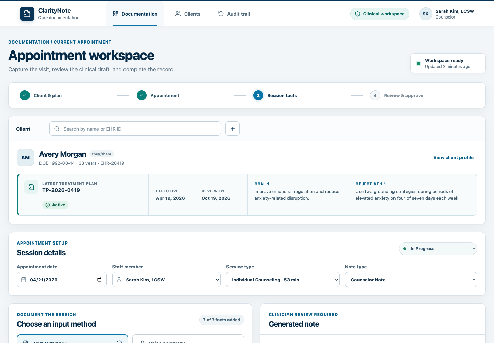
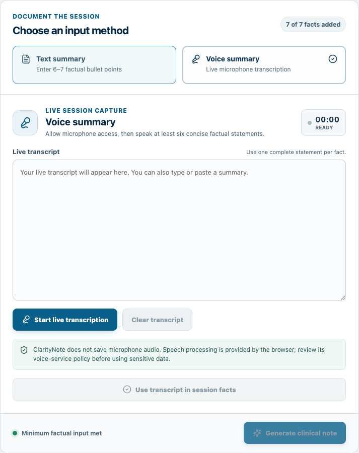
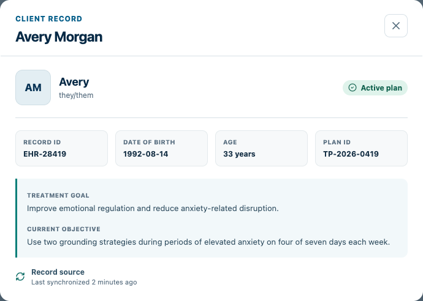
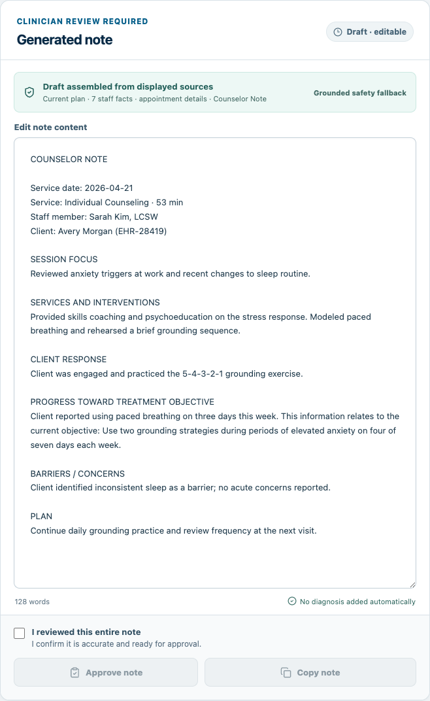
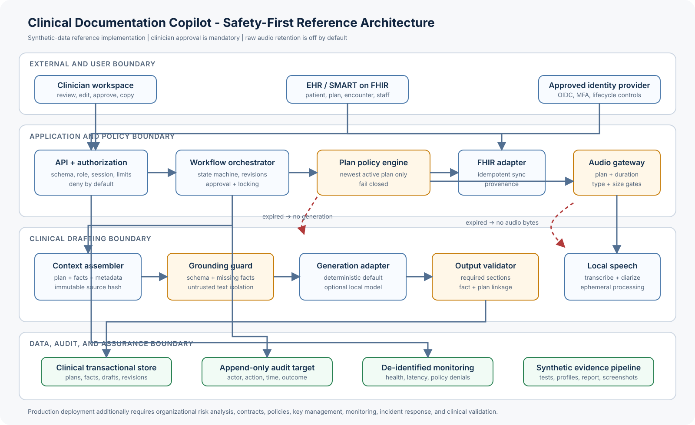

# Clinical Documentation Copilot

[](https://clinical-documentation-copilot.vercel.app/)
[](https://github.com/manideepe/clinical-documentation-copilot/actions/workflows/ci.yml)
[](LICENSE)

A safety-first, treatment-plan-aware reference implementation for clinician-controlled EHR documentation. The project contains a FastAPI workflow service and an accessible React interaction prototype, alongside protected low-cost Ollama drafting, deterministic grounded fallback generation, encrypted field persistence, reproducible synthetic healthcare data, automated release evidence, and a 31-page research report.

**Author:** Manideep

**Release date:** April 18, 2026

**Evidence snapshot:** April 18, 2026

**License:** MIT

> This is a research and engineering reference implementation. It is not a medical device, does not provide medical advice, does not establish clinical efficacy, and does not claim HIPAA compliance or production readiness.

## Live dashboard

### [Open the public synthetic-data dashboard →](https://clinical-documentation-copilot.vercel.app/)

[](https://clinical-documentation-copilot.vercel.app/)

_Redesigned clinical workspace showing workflow progress, current patient context, the active treatment plan, and appointment setup. Click the screenshot to open the live dashboard._

### Feature evidence

| Live voice workflow | Client profile | Review and approval |
|---|---|---|
| [](https://clinical-documentation-copilot.vercel.app/) | [](https://clinical-documentation-copilot.vercel.app/) | [](https://clinical-documentation-copilot.vercel.app/) |
| Permission-led browser transcription with editable transcript mapping. | Read-only identity, source, and current-plan context. | Grounding receipt, editable draft, safety cue, and human approval gate. |

The hosted Vercel demo uses fictional fallback clients, stores no server-side appointment data, and does not deploy the SQLite-backed FastAPI reference service. Visitors can create additional fictional test clients; those records stay in that browser's local storage until its site data is cleared. Draft requests pass through a same-origin Vercel function that keeps the Ollama credential server-side and falls back to deterministic grounded generation if the model service is unavailable. Do not enter real patient information.

## Project guide

| Resource | Purpose |
|---|---|
| [Live dashboard](https://clinical-documentation-copilot.vercel.app/) | Try the public synthetic-data workflow. |
| [System architecture](docs/architecture.md) | Understand trust boundaries, plan selection, drafting, and persistence. |
| [Threat model](docs/threat-model.md) | Review security assumptions, abuse cases, and mitigations. |
| [Dataset governance](docs/data-governance.md) | Reproduce and audit the unrestricted MITRE Synthea benchmark. |
| [Validation plan](docs/validation-plan.md) | Review acceptance criteria and evidence strategy. |
| [Research report](output/pdf/clinical_documentation_copilot_research_report.pdf) | Read the verified 31-page publication-style report. |

## What is implemented

- Five appointment states with server-enforced transitions and terminal locking.
- Idempotent client and treatment-plan synchronization boundaries.
- Fail-closed selection of exactly one newest currently effective active plan.
- Eight distinct documentation contracts: case management, child and adult assessments and updates, counselor, E&M, and nursing progress.
- Deterministic drafting from appointment metadata, selected plan content, and clinician-supplied facts only.
- Source-fact and plan-snapshot bindings that invalidate stale drafts before approval or completion.
- Six-or-seven-fact text capture plus browser-native live microphone transcription with interim results, editable transcript review, and structured fact mapping.
- Protected same-origin Ollama drafting with a fixed low-usage `gpt-oss:20b` model, bounded input, strict grounding instructions, no-store responses, and a deterministic safety fallback.
- Explicit expired-plan denial for voice processing and note generation, while preserving factual text for deferred generation.
- Review, editing, approval, revision history, completion, and audit workflows.
- Fernet encryption for selected protected fields, separate audit HMAC integrity, bounded inputs, security headers, and role permissions.
- A React/Vite interaction prototype with active-plan and expired-plan paths plus browser-local creation of fictional test clients.
- Reproducible profiling of the official MITRE Synthea COVID-19 10K CSV archive.

## Evidence at a glance

| Evidence | Result |
|---|---:|
| Synthetic patients | 12,352 |
| Clinical-fact rows | 2,837,098 |
| All CSV data rows | 2,928,115 |
| Patient foreign keys checked | 2,878,490 |
| Encounter foreign keys checked | 2,472,082 |
| Temporal ranges checked | 809,029 |
| Backend tests | 23 |
| Frontend workflow tests | 10 |
| Note contracts | 8 |
| Research report | 31 pages |

Dataset counts exclude headers. The integrity scan passed with warnings: 67 upstream synthetic medication rows have a stop date before the start date. They are preserved and reported rather than silently repaired. See [dataset governance](docs/data-governance.md) and the structured [evidence](evidence/dataset/row_counts.json).

## Architecture



In the FastAPI service, the caller never chooses the authoritative treatment plan. At read, generation, approval, and completion boundaries, the service evaluates current plan state and rejects missing, expired, inactive, or equally current candidates. A generated draft is bound to hashes of both the plan snapshot and source-fact snapshot. Clinician edits create revisions; completed and cancelled records are locked.

The React workspace visually demonstrates the same intended experience but is not an end-to-end client for the appointment API. It reads the backend client list when available; appointment creation, fact saving, review, approval, completion, and activity entries remain non-persistent client-side demo state. Fictional clients created in the UI persist only in that browser. Draft generation can use the protected serverless Ollama route or the deterministic fallback. Backend enforcement is verified independently through the API test suite.

Read the full [architecture](docs/architecture.md), [threat model](docs/threat-model.md), [FHIR/SMART mapping](docs/fhir-smart-mapping.md), and [validation plan](docs/validation-plan.md).

## Run locally

Requirements: Python 3.11+, Node.js 20+, and `make`.

```bash
git clone https://github.com/manideepe/clinical-documentation-copilot.git
cd clinical-documentation-copilot
make setup
```

Start the API:

```bash
make run-api
```

In another terminal, start the interface:

```bash
make run-ui
```

Open `http://127.0.0.1:5173`. The Vite development proxy supplies documented development-only identity assertions outside browser code. The UI reads `/api/v1/clients` and uses two fictional fallback clients if the local API is unavailable or contains no synchronized records. Its appointment and documentation actions are local prototype state and are not persisted to FastAPI; use the API contracts and backend tests to exercise server-enforced workflows.

For live voice, open the site over `https://` or on localhost, choose **Voice summary**, and allow microphone access. Browser speech-recognition support varies; when it is unavailable, the same panel accepts a typed or pasted transcript. ClarityNote does not persist microphone audio, but the browser may use its own speech service, so this public demo must not be used with sensitive data.

## Deployment

The `frontend/vercel.json` configuration publishes the React/Vite prototype and its `/api/generate` serverless route with `frontend/` selected as the Vercel project root. `OLLAMA_API_KEY` is configured only as a sensitive Vercel environment variable and must never be added to browser code or version control. The project is connected to the repository's `main` branch, so verified GitHub pushes automatically create a new production deployment. Connect a production-approved API, durable persistence, identity layer, governed model provider, and organization rate limiting only after completing the deployment obligations documented in this repository.

## Synthetic benchmark

Raw benchmark files are intentionally excluded from Git. Reproduce the official MITRE Synthea archive, source receipt, hashes, profiles, and integrity results with:

```bash
make data
```

The download is approximately 57 MB and extracts to approximately 560 MB. The pipeline uses unrestricted synthetic data only; MIMIC and other credentialed datasets are excluded.

## Verification

Run the application suites and quality checks:

```bash
make test
make lint
make build
make audit
```

Refresh the complete machine-readable release record and local latency smoke benchmark:

```bash
make evidence
```

Generate and verify the publication-style report:

```bash
make report
```

The final report is [Clinical Documentation Copilot: A Safety-First Reference Architecture for Grounded Clinical Documentation](output/pdf/clinical_documentation_copilot_research_report.pdf). Its sole listed author is Manideep.

## Repository layout

```text
backend/          FastAPI service, persistence, policy engine, tests
frontend/         React/Vite clinician workspace and UI tests
data/             ignored raw/processed benchmark locations
docs/             architecture, security, governance, mappings, research
evidence/         dataset receipts, test inventory, performance, screenshots
output/pdf/       verified 31-page research report
scripts/          download, profile, validate, benchmark, evidence, report tools
```

## Demonstrated safeguards and production boundary

The repository demonstrates deterministic grounded structuring, selected-field encryption, input validation, role checks, session expiry, idempotency, immutable terminal states, revision history, HMAC-chained write-event audit records, and no raw-audio persistence.

It does **not** implement a production identity provider, per-client/team object authorization, complete PHI-read and denial auditing, managed key rotation, full-database or backup encryption, direct FHIR server connectivity, EHR document write-back, speaker diarization, organization-managed templates, server-side client management, centralized monitoring, retention automation, clinical validation, or regulatory certification. Browser-native speech recognition and browser-local fictional client creation are demonstration features, not governed production integrations.

The backend text-only transcript endpoint remains an adapter boundary for a future locally governed speech service. The hosted frontend uses the visitor's browser speech-recognition capability. Its drafting request uses a same-origin Vercel function, so no visitor supplies or receives the Ollama credential. The copy control is a user-directed transition aid, not a direct EHR integration.

## Data and privacy

No real patient records, MIMIC data, recordings, local databases, credentials, or raw benchmark CSV files belong in version control. Synthetic data reduces benchmark privacy risk but does not establish security, representativeness, fairness, or clinical validity.

See [SECURITY.md](SECURITY.md) for reporting and deployment guidance and [CONTRIBUTING.md](CONTRIBUTING.md) for repository rules.

## Citation

Citation metadata is available in [CITATION.cff](CITATION.cff). Cite Synthea separately when using the benchmark pipeline.

## License

Source code is released under the [MIT License](LICENSE). Synthea-generated benchmark data is downloaded separately and retains its upstream Apache 2.0 notices and terms.
