# Reference architecture

## Design intent

Clinical Documentation Copilot is a modular reference implementation for a
clinician-controlled drafting workflow. The architecture separates identity,
clinical synchronization, appointment state, audio processing, note generation,
validation, and audit. That separation makes the two critical policy decisions
enforceable at multiple boundaries:

1. Only the newest active treatment plan may be used.
2. An expired treatment plan disables capture, upload, processing, and retention
   of audio and defers note generation.

The implementation uses SQLite and deterministic local generation for a free,
reproducible demonstration. The production target replaces those adapters with
organization-approved identity, database, key, EHR, transcription, and inference
services without changing the domain policies.

## Component responsibilities

| Component | Responsibility | Safety boundary |
|---|---|---|
| Clinician workspace | Appointment setup, summary capture, review, editing, approval, copy | Never completes without an approved draft and required fields |
| API and identity adapter | Authentication context, authorization, request limits, input validation | Denies operations outside the user's role |
| Workflow orchestrator | State transitions and invariants | Prevents generation/completion in invalid states |
| EHR/FHIR adapter | Idempotent client sync and plan retrieval | Normalizes external identifiers; never treats historical plans as current |
| Plan policy engine | Selects the newest active plan at each policy decision | Fails closed on missing, expired, or equally current plan state |
| Grounded generation pipeline | Builds constrained context, produces draft, validates claims | Treats source facts as immutable and leaves missing information explicit |
| Audio policy gateway | Applies plan, consent, duration, type, and size checks before bytes are accepted | Rejects every audio operation when the plan is not active |
| Local speech adapter | Optional transcription and speaker segmentation | Temporary processing with raw retention disabled by default |
| Clinical store | Clients, plans, appointments, drafts, revisions | Application-level controls plus deployment-level encryption and backups |
| Audit ledger | Append-only security and clinical workflow events | Excludes raw note content and other unnecessary sensitive data |
| Evidence pipeline | Synthetic data profiling, tests, reports, screenshots | Uses no real or restricted patient data |

## State model

```mermaid
stateDiagram-v2
    [*] --> Scheduled
    Scheduled --> InProgress: start + required setup
    Scheduled --> Cancelled: cancel
    InProgress --> DocumentationPending: save facts + plan unavailable/expired
    InProgress --> DocumentationPending: end session
    DocumentationPending --> DocumentationPending: save immutable source facts
    DocumentationPending --> ReviewRequired: newest active plan + generate
    ReviewRequired --> ReviewRequired: edit draft / add revision
    ReviewRequired --> Completed: clinician review + approval + validation
    Completed --> Completed: locked; read/audit only
    Cancelled --> Cancelled: terminal
```

`Waiting for Treatment Plan` is represented as a reason on the
`Documentation Pending` state so reporting remains consistent with the five
required top-level appointment statuses.

## Plan selection invariant

Given all plans for a client and the current decision date, the policy engine:

1. Filters to plans whose status is active.
2. Requires `effective_date <= decision_date`.
3. Requires no expiration date or `decision_date <= expiration_date`.
4. Orders eligible plans by effective date, source-update time, and local ID.
5. Selects exactly one newest plan; equally current candidates fail closed.

Generation stores the chosen plan identifier, a hash of its source snapshot, and
a hash of the clinician-supplied source facts with the draft. Before approval and
completion, the service rechecks those bindings and the newest-active-plan rule.
Any source or plan change invalidates the prior draft and requires regeneration;
saved source facts are not silently modified.

## Grounding contract

The generator receives a deliberately small evidence packet:

- appointment metadata;
- selected note type and schema;
- current treatment goals and objectives;
- clinician-entered bullets or an approved transcript-derived fact list; and
- explicit missing-field markers.

It may reorganize and phrase those facts, but it may not invent diagnoses,
symptoms, interventions, quotations, response, progress, or risk conclusions.
The validator checks required sections, identifiers, known denied phrases, and
source-plan linkage. A deterministic template generator is the safe default.
Any probabilistic model is an optional adapter behind the same validator and
human-review gates.

## Interoperability boundary

The reference adapter maps EHR resources without assuming write access:

- Patient -> synchronized client identity;
- CarePlan -> treatment plan, goals, objectives, lifecycle dates;
- Encounter -> appointment metadata;
- Practitioner/PractitionerRole -> staff identity and role; and
- DocumentReference or organization-specific write API -> future approved export.

SMART App Launch with OAuth 2.0 is the intended authorization profile. The demo
copy-to-clipboard action is a transitional user-controlled export, not an EHR
write integration.

## Deployment boundaries

The repository demonstrates code-level safeguards only. A real deployment also
requires TLS termination, approved identity lifecycle controls, network
segmentation, encrypted backups, key rotation, security monitoring, vulnerability
management, retention policies, business agreements, risk analysis, incident
response, continuity testing, clinician validation, and privacy review.
